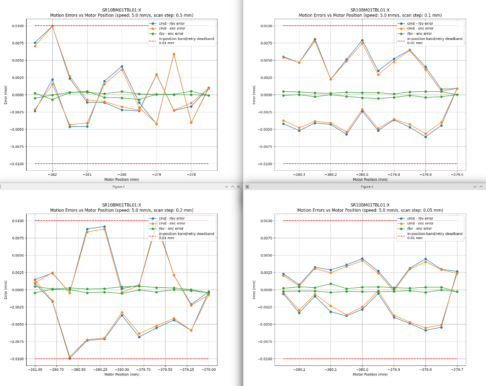

# sci-instru-control

Scripts for instruments control from my work as a beamline scientist
at the Powder Diffraction beamline at the Australian Synchrotron (ANSTO).

These scripts automate repetitive workflows and enable full customisation of
data collection routine.

This is a curated subset of a larger personal repository, kept for reference.

## What's here

| Area | What it demonstrates |
|---|---|
| **Instrument control & testing** (`instrument_control/`) | Real-time data acquisition over EPICS (`pyepics`), state-machine polling with timeouts, hardware qualification with live-updating `matplotlib` plots, `argparse` CLIs |

## Runnable vs reference

| Script | Runs without a beamline? |
|---|---|
| `instrument_control/detector_gain_time_sweep.py`, `instrument_control/motor_validation.py`, `instrument_control/xrpad_acquisition_prototype.ipynb` | No — these need a live EPICS IOC and real hardware on the beamline network. Included as code samples. |

## Scripts

### `instrument_control/`
- **`motor_validation.py`** — Validate a motor stage over EPICS following refurbishment of motion controllers (speed / acceleration / accuracy / repeatability tests selected by CLI flags), comparing commanded vs readback vs encoder position against a tolerance band with a live error plot.
- **`detector_gain_time_sweep.py`** — Sweep detector gain × exposure time, trigger acquisitions over EPICS, and block on acquisition status with a generator-based timeout poll.
- **`xrpad_acquisition_prototype.ipynb`** — *(exploratory)* Interactive precursor to `detector_gain_time_sweep.py`.

#### Example: `motor_validation.py` accuracy test



Accuracy test on the `SR10BM01TBL01:X` linear stage after a motion-controller
refurbishment. Each panel is a different scan step (0.5 / 0.2 / 0.1 / 0.05 mm) at
5 mm/s; the plot updates live as the test runs. Commanded−readback and
commanded−encoder errors stay within the ±0.01 mm in-position band (dashed),
while the readback−encoder error stays near zero — the stage meets spec.

## Setup

```bash
python -m venv .venv && source .venv/bin/activate
pip install -r requirements.txt
```

## License

MIT — see [LICENSE](LICENSE).
